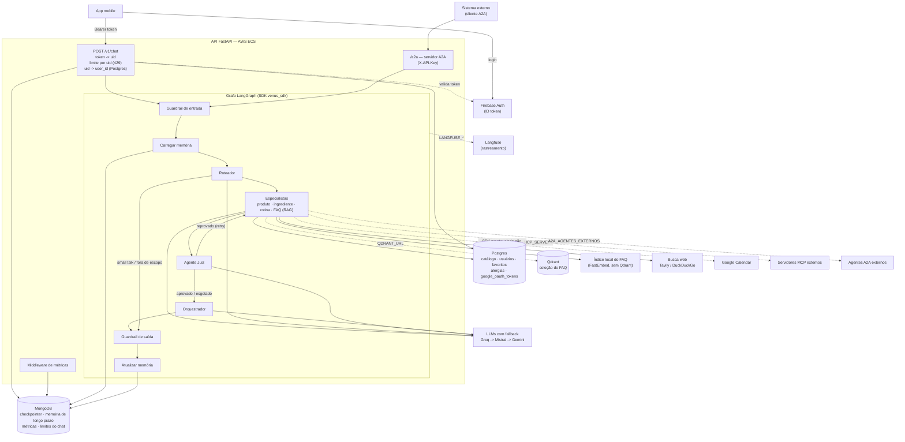
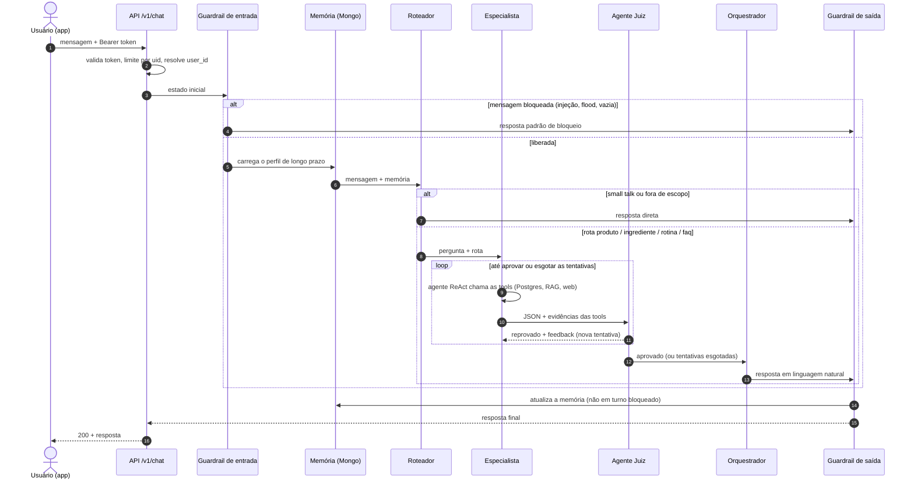

# Arquitetura do sistema Venus (IA)

Visão de alto nível da API (`Venus-AI-api`) e do SDK (`Venus-AI-Sdk`), como
estão no código. Linhas tracejadas são componentes **opcionais**, que só ligam
com a variável de ambiente correspondente.

## Componentes

- **Identidade:** o `uid` vem do token do Firebase; o `user_id` do Postgres é
  resolvido pela API (`venus.users.firebase_uid`), nunca enviado pelo app. Dentro
  do grafo, as tools de dados da conta usam sempre o usuário da conversa.
- **FAQ:** com `QDRANT_URL`, a coleção do Qdrant (alimentada por
  `python -m venus_sdk.rag.faq_ingest`); sem ela, o índice local sobre
  `venus_api/data/faq/`, com o mesmo modelo de embeddings.
- **A2A:** servidor em `/a2a` (chave no header); conversas A2A ficam no
  namespace `a2a:` do checkpointer, separadas das do app.

## Uma mensagem pelo grafo

